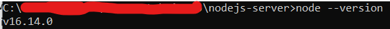

## Intro to Node.js

You can use the [editor on GitHub](https://github.com/cmartin00/cmartin00.github.io/edit/main/index.md) to maintain and preview the content for your website in Markdown files.

Whenever you commit to this repository, GitHub Pages will run [Jekyll](https://jekyllrb.com/) to rebuild the pages in your site, from the content in your Markdown files.

### Markdown

Markdown is a lightweight and easy-to-use syntax for styling your writing. It includes conventions for

```markdown
Syntax highlighted code block

# Header 1
## Header 2
### Header 3

- Bulleted
- List

1. Numbered
2. List

**Bold** and _Italic_ and `Code` text

[Link](url) and 
```

Since the inception of JavaScript in 1995 it has dominated the web alongside HTML and CSS. Nearly every single website incorporates JavaScript and it is supported by every major web browser. Traditionally, JavaScript has been used as a way of generating dynamic content for web pages, relying on implementation with HTML documents to be useful. However, nowadays, apps of all kinds can be created using %100 JavaScript—and Node.js is a big part of that.

So what is Node.js? Simply put, it’s a JavaScript runtime environment based off of Google Chrome’s V8 Engine. It allows us to execute JS code outside of the web browser, which means we can use it to build things like application servers or command line tools, rather than just webpages. Node also includes the npm package manager, which grants access to thousands of libraries that can be used to further expand the functionality of node. You could have a database, web server, and frontend all built entirely in JavaScript depending on the packages you use.

### Hello World

After installing Node.js from the official website, you’ll be able to run node apps from the command line. To make sure you’ve correctly installed and configured node, open the command line and run the following command:



