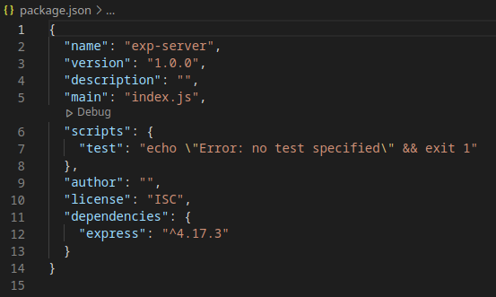
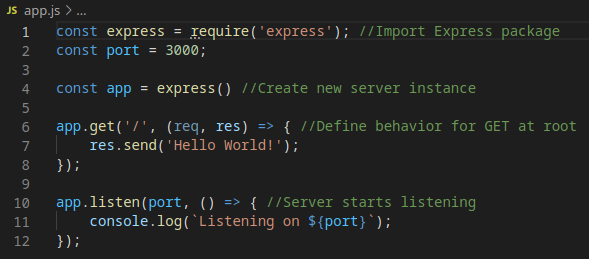

## Making an App with Node.js and Express

Node is a powerful tool that allows us to run JavaScript outside of the browser. When used with npm (Node Package Manager), we can create robust and functional applications using nothing but JavaScript. npm grants access to thousands of open-source libraries that we can use to add functionality to our JavaScript code.

In the previous post we very briefly went over how to create a simple server with Express. However that is merely scratching the surface of what is possible with Express. We can use an Express server to post Hello World, but we can also use it for serving real, useful data. Express makes working with Node's http features a lot easier, so we can focus on building the features of our server.

### Introduction to Express

Express is a framework made for building webservers and APIs. Express is built on top of Node's own http module, but is a lot simpler. Express implements a lot of things for us that Node doesn't, such as request/response handling, session handling, and routing. Without Express, we would have to implement all these things by hand. Luckily, we can use npm to install express for us and start working with it immediately. Open the terminal and type the following commands:

The command 'npm init' will initialize your current directory as a project directory, and allow you to install npm packages into this directory. The command will ask you for various details surrounding your project. For this project, they won't matter, so you can leave them all blank. The way you interact with this file will change depending on the packages you use, so consult documentation to find out how to tweak this file to your specific needs. To add Express as a dependency to your now existing project, enter the following command:

This command will add Express as a dependency to the project, which can be verified by checking the package.json file. This file holds all the information that was entered earlier, as well as information about installed dependencies.

This is what your package.json file should look like if you used all defaults, and have installed Express. Now that we've confirmed that we have Express, we can start off by building our server and trying to post a Hello World.

Create a file named 'app.js'. This will be the script we use to define the behavior of our server, and the script we will call when we want to start the server. Now consider the following code:

The above code is all we need to create an Express server that posts Hello World for us. First, we have to import the Express package to our file so that we can actually use it. We do this by using the require() function which will import the named dependency as an object that we can interact with. In this case, we can use that object, 'express', to create a new server by calling its constructor. This creates our 'app' object, which is the server itself that we will be interacting with.

The app.get() method defines the behavior of the server in response to a GET request at that particular URL. In this case we're using the address '/' to define the behavior at our servers root, or 'homepage'. The res.send() method defines the content of our response, and sends it for us.

Lastly, app.listen() will open up the server at the given port number, and then execute the given callback function. In this case we are just using the function to confirm that our server is up.

Now, if you were to start the server using the following command:

And open up your browser, and navigate to http://localhost:3000, you should see a blank page saying 'Hello World'.

### Taking User Input through Parameters

Now that we know how to build an Express server and define the behavior at certain URLs, we can start working on something more functional than Hello World. Of course a big part of requests are request parameters, and if we want our user to be able to interact with our server in a meaningful way, we'll need a way to get parameters from requests. Express makes this very simple for us, and grants us access to the request's parameters through the 'query' object. The query object is part of the req object, and holds the requests parameters in it for us. We can access them like so:

We can simply get the parameter as an object from the query object. We can then do whatever we like with the data from that parameter. In this case, we're going to print it to the page. Now, if you want to do Hello World, you'll have to send this request:

### Serving Content on the Server

We don't always want to point people to a webpage. Express supports serving a variety of useful content types that we can use for passing data between applications. If you want to send response content of a specific type, the 'res' object contains methods for accomplishing this task. As an example, we'll return a JSON object, since they are one of the most common types of file to serve on a webserver. Consider the following code:

The above code will create a JSON object containing the given string and then return it to us on a request. Using the res.json() method instead of the res.send() method will ensure that our response is sent as a JSON object. Now, if we send the following request:

You should get the following response:

### Sending Requests to the Server

If our response type is JSON, then more often than not we're going to want to access that response programatically rather than in our web browser. To do this, we're going to use Node's http module, which gives us access to methods for sending requests and parsing the response. In a new script called request.js, we'll have the following code:

The http.get() method will send a GET request to the given URL, and will parse the response using the given function. Node gives access to the response in the form of a data stream, so we have to create an empty string for us to write to with the data from the stream. The res.on('data') method creates a listener for the data stream and will write to our response for us. The res.on('end') method will create a listener for the end of the stream, where we'll be able to parse the entire response. This function is where we'll want to handle our response. If you run this script, you should see the following result:

We have succesfully retrieved a JSON object from our server using another script. With this we effectively created a distinct front-end and back-end with our two scripts. The next step is to take user input in the request.js script to determine our request parameters. We can do this by passing arguments through the command line. In Node, we can access command line arguments through an array, 'process.argv'. Example:

The above output is generated by printing the entire array. You might notice that we did not enter the first two elements of the array, so we don't want them. We access the array in a way that doesn't include those first two elements, so we only get inputs:

Now we can use this array to manipulate our URL, and return different resources from the server. This can be done by adding the following code before our http.get():

This code will create a space delimited string of all our arguments, and then append them to our server's address as a parameter.
Now, a Hello World with our program looks like this:

### Conclusion

Our app now has a back-end server that parses our input and returns a JSON object, and a front-end that can take input from the user and send requests to the server, displaying the response. The example given is simple, merely returning strings, however the principles learned in this article will be true for any scale of development with Express. Expanding the functionality is as simple as defining the behavior at additional URLs. And since our front-end is a regular Node script, that means we could use one of the many front-end packages available for Node, such as React or Electron, to build it out into a proper front-end. Express is a great technology for building webservers and APIs, and without it we would have to have written a lot more code using Node's http module.

[Link](https://drive.google.com/drive/folders/15babrV7VjtvxazJd03XSLbf8EvrtbTVt?usp=sharing)

