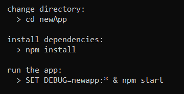

## Intro to Node.js

Since the inception of JavaScript in 1995 it has dominated the web alongside HTML and CSS. Nearly every single website incorporates JavaScript and it is supported by every major web browser. Traditionally, JavaScript has been used as a way of generating dynamic content for web pages, relying on implementation with HTML documents to be useful. However, nowadays, apps of all kinds can be created using %100 JavaScript—and Node.js is a big part of that.

So what is Node.js? Simply put, it’s a JavaScript runtime environment based off of Google Chrome’s V8 Engine. It allows us to execute JS code outside of the web browser, which means we can use it to build things like application servers or command line tools, rather than just webpages. Node also includes the npm package manager, which grants access to thousands of libraries that can be used to further expand the functionality of node. You could have a database, web server, and frontend all built entirely in JavaScript depending on the packages you use.

### Hello World

After installing Node.js from the official website, you’ll be able to run node apps from the command line. To make sure you’ve correctly installed and configured node, open the command line and run the following command:

You can run a file from the command line like so:

Where ‘app.js’ is the script you’d like to run.

Now consider the following code snippet:

If we run this script, it will start a web server that we can visit at the address http://127.0.0.1:3000. The webpage will consist of a single <h1> element reading ‘Hello World’.

First, we include the Node.js http module. This module gives us the tools we need to build the webserver, as well as work with http requests. The hostname and port number are then set. These will combine to form the local address of your webapp that you can access via your web browser.

The http.createServer() method creates the http server and determines request/response behavior.  The server.listen() method will then open the server at the given port and hostname. It will then execute the provided callback function when the server is ready.

Of course, a web server is just one way we can use node. A Hello World could also be as simple as this:

Which when run in node, will look like this:

### NPM

We already saw how the http module helps us to create web servers. Using the npm package manager, we can download other modules to further expand the functionality of node. As an example, we’ll use npm to install Express, a popular application framework for node apps.

Navigate to your project directory and run the following command:

Running ‘npm install’ with the package name will install the package to the current directory. The -g flag gives the package global visibility on the system. Here we are installing express-generator, which is a package that will allow us to create Express apps.

After you’ve installed express-generator, you’ll be able to build Express apps using the following command

This will create a directory called newApp with the Express app within it. Your terminal will also show you a list of commands you should run before starting your app for the first time.

ter navigating to newApp, npm install will install any dependencies needed by your application. npm start will then start the Express application, which you will be able to access via web browser at http://localhost:3000.

This is one example of how npm can change how we work with Node. Notice how the block of code from the Hello World example compares to our Express app—instead of writing a script to build our web server, we can run a couple of commands in the command line and we get a base for our application as well as a framework to work with.

### NPX

Npx is similar to npm in that it is used to manage Node packages. However, with npm, we are usually installing a package that we want to use long-term. With npx, we are not installing the packages but rather running them, and they are only stored on our machine temporarily. As an example, we will use npx to create a React application.

Open the command line and run the following command:

The npx package manager will run the create-react-app package and create a new React application in a directory named new-app. The terminal will then tell you how to start your application, and you will be able to access it via web browser at http://localhost:3000.

If you are unsure whether or not to use npm or npx to load a package, check the package’s documentation.

### Core Modules

We saw in our Hello World example how we can use Node’s http module for building a web server. Node has a number of different modules for different system functions that extend JavaScript’s functionality outside of the browser.

### http

The http module provides functionality for networking and web servers. Classes are provided for an HTTP server, request, response, as well as support for numerous methods such as GET, POST, PUT, DELETE, etc.

### fs

The fs module provides access to the file system. This module allows Node to read and write to files on the system, as well as create and delete them. Also provides methods for managing file properties.

### events

The events module provides methods and classes for building event driven programs. An EventEmitter object can be used to define an event and associate it with a callback function, and then emit these events when needed.

### path

The path module allows you to work with and manipulate directories and file paths. It provides methods for extracting information from file paths such as directory names and file types.

### os

The os module allows Node to access information about the operating system, such as system architecture, CPUs, and network interfaces.

